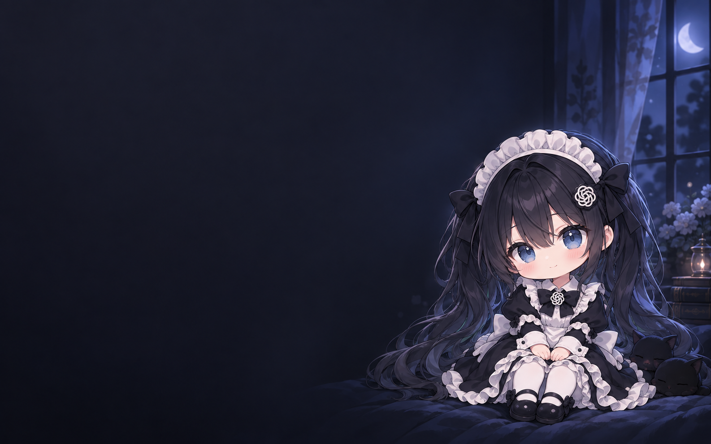
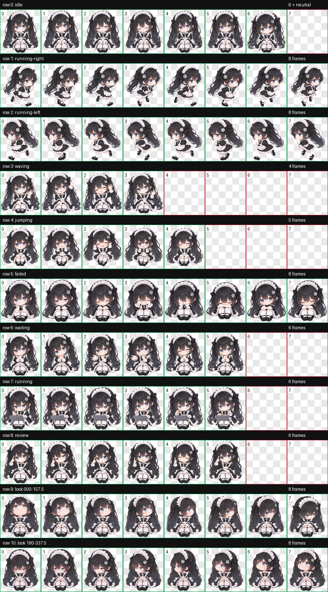
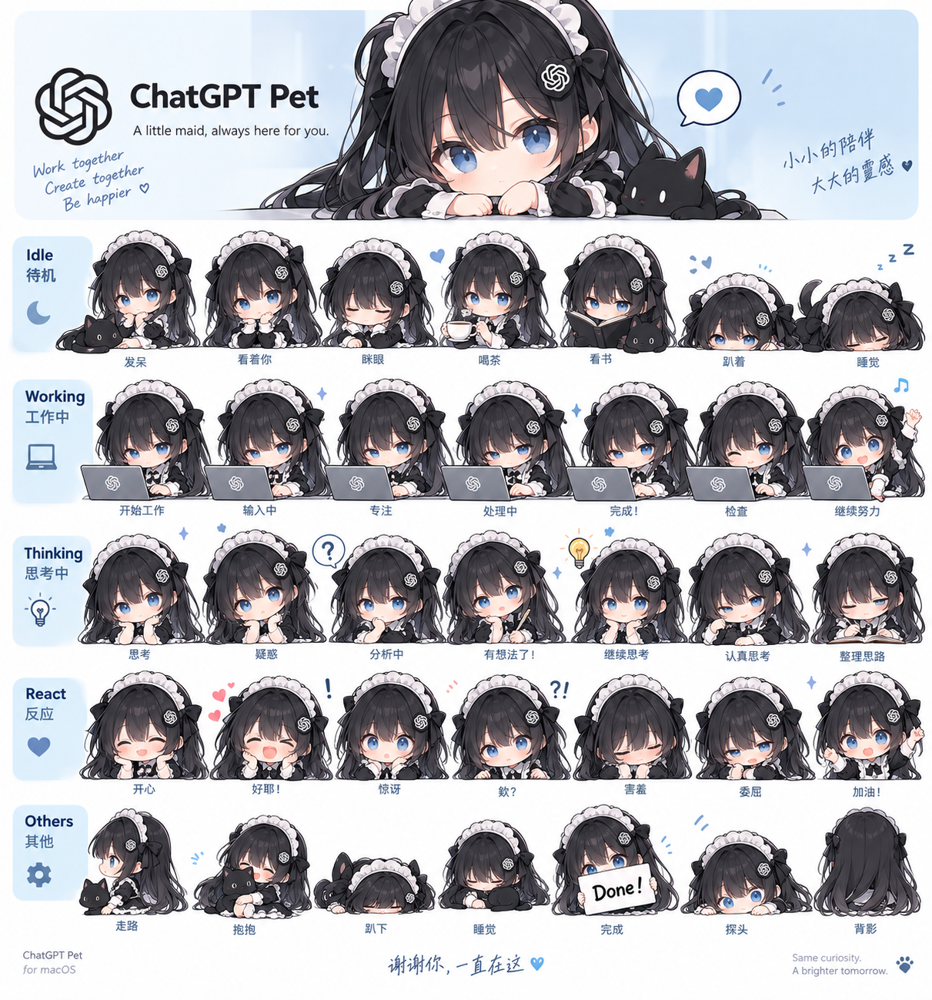

<div align="center">

# Little Blue · 小蓝

**一位黑发蓝眼的小女仆，陪你把灵感慢慢变成现实。**

为 ChatGPT 桌面端制作的自定义宠物资源 · 小蓝「活泼版」



<br />


[下载资源](https://github.com/LinfengJang/little_blue/archive/refs/heads/main.zip) · [安装小蓝](#安装小蓝) · [看看动作](#看看动作) · [本地试玩](#本地试玩)

</div>

---

## 认识小蓝

她会安静地眨眼，也会认真打字；等待时歪歪头，开心时举起双手。

小蓝保留了黑色双马尾、蓝色眼睛、蝴蝶结与黑白女仆装的统一设计，让工作间隙多一点轻松的陪伴。本仓库提供可安装的宠物素材、动画预览和本地试玩页面。

> 这是自定义宠物资源项目，需要支持本地 Pet 的客户端加载。它不是独立桌宠应用，也不是 OpenAI 官方角色。

## 看看动作

<table>
  <tr>
    <td align="center"><br /><b>安静陪伴</b><br /><sub>呼吸、眨眼，等你开始</sub></td>
    <td align="center"><br /><b>向你招手</b><br /><sub>抬起小手，笑着打招呼</sub></td>
    <td align="center"><br /><b>一起开心</b><br /><sub>举手欢呼，分享小小喜悦</sub></td>
  </tr>
  <tr>
    <td align="center"><br /><b>歪头等你</b><br /><sub>伸出手掌，再微笑收回</sub></td>
    <td align="center"><br /><b>认真工作</b><br /><sub>交替打字，偶尔抬眼看看你</sub></td>
    <td align="center"><br /><b>有了想法</b><br /><sub>思考、领会，再轻轻点头</sub></td>
  </tr>
</table>

还包含向左移动、向右移动和失落动作，以及 **16 个注视方向**。动作素材由客户端按状态调用；具体触发方式取决于客户端版本。

<details>
<summary><b>展开查看完整动作图</b></summary>



</details>

<details>
<summary><b>展开查看角色设计参考</b></summary>



参考板用于展示角色设定，不代表图中每个姿态都有独立的客户端交互。

</details>

## 安装小蓝

适用于支持 `spriteVersionNumber: 2` 和本地宠物目录的 macOS 客户端。

1. [下载仓库 ZIP](https://github.com/LinfengJang/little_blue/archive/refs/heads/main.zip) 并解压。
2. 在 Finder 按 **⌘ ⇧ G**，前往 `~/.codex/pets/`。目录不存在时，先在 `~/.codex/` 下创建 `pets` 文件夹。
3. 将仓库中的 **`bluebell-playful` 整个文件夹**复制进去，保留其中的 `pet.json` 和 `spritesheet.webp`。如果已经安装同名版本，请先备份原文件夹。
4. 打开客户端的 **设置 → 宠物 / Pets**，刷新列表后选择 **「小蓝 · 活泼版」**。如果列表没有更新，可重启客户端再查看。

安装后的目录应是：

```text
~/.codex/pets/
└── bluebell-playful/
    ├── pet.json
    └── spritesheet.webp
```

如果设置过 `CODEX_HOME`，请将宠物放在 `$CODEX_HOME/pets/` 下。不要把整个仓库文件夹作为宠物目录，也不要只复制角色参考图 `pet.png`。

## 本地试玩

下载并解压仓库后，用浏览器打开 **[新旧对比与试玩.html](新旧对比与试玩.html)**。请保留它与 `preview-assets/`、`bluebell-playful/` 的相对位置。

页面可以对比新旧动作，并体验单击挥手、双击欢呼、拖动等交互。GitHub 文件页展示的是 HTML 源码，需要下载后在浏览器中打开。

> **预览页交互与原生客户端是两回事。** 页面中的交互逻辑不会随宠物素材一起导入。16 个注视方向也不等于客户端会跟随普通桌面鼠标转头；是否播放由客户端决定。

## 资源一览

| 文件 / 目录 | 用途 |
| :--- | :--- |
| [`bluebell-playful/`](bluebell-playful/) | 安装到客户端的宠物资源 |
| [`动画预览/`](动画预览/) | 各状态的 GIF 预览 |
| [`新旧对比与试玩.html`](新旧对比与试玩.html) | 在本地浏览器中对比和试玩 |
| [`preview-assets/`](preview-assets/) | 对比页面使用的原版素材 |
| [`新版动作总览.png`](新版动作总览.png) | 动画帧总览 |
| [`pet.png`](pet.png) | 角色设计参考图 |
| [`导入说明.txt`](导入说明.txt) | 随包安装说明 |
| [`docs/images/bluebell-moonlight.png`](docs/images/bluebell-moonlight.png) | README 月光插画，可单独保存 |

<details>
<summary><b>资源格式与兼容性</b></summary>

| 项目 | 规格 |
| :--- | :--- |
| 宠物 ID | `bluebell-playful` |
| 显示名称 | 小蓝 · 活泼版 |
| Sprite 版本 | `2` |
| 素材格式 | 透明 WebP |
| 整图尺寸 | `1536 × 2288` |
| 图格排列 | `8 列 × 11 行` |
| 单格尺寸 | `192 × 208` |
| 动作状态 | 待机、左右移动、挥手、开心、失落、等待、工作、思考 / 检查 |
| 注视方向 | 16 个方向 |

本项目仅提供素材与预览，不修改客户端触发逻辑。它不会添加喂食、好感度等系统，也不会把 README 插画设置为聊天背景。

</details>

## 关于制作

角色与插画由 AI 辅助生成，动画素材经过整理、装配与检查。发现显示异常时，可以通过 [Issues](https://github.com/LinfengJang/little_blue/issues) 提供客户端版本、出现问题的状态和截图。

---

<div align="center">

**小蓝在这里，陪你完成下一件小事。**

<sub>Little Blue · 黑发、蓝眼睛，还有一点点陪伴。</sub>

</div>
